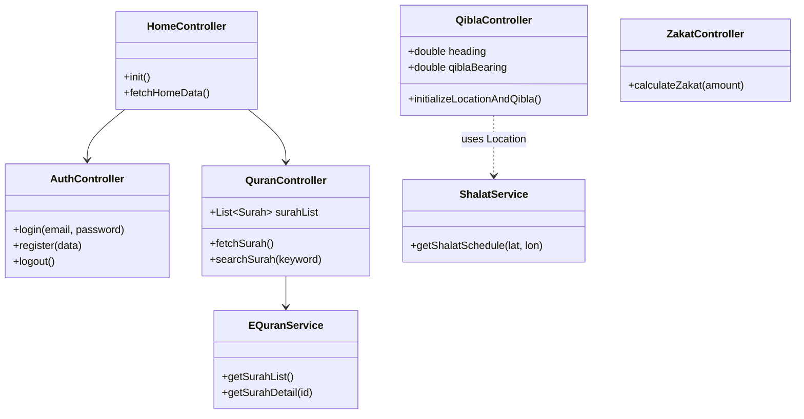
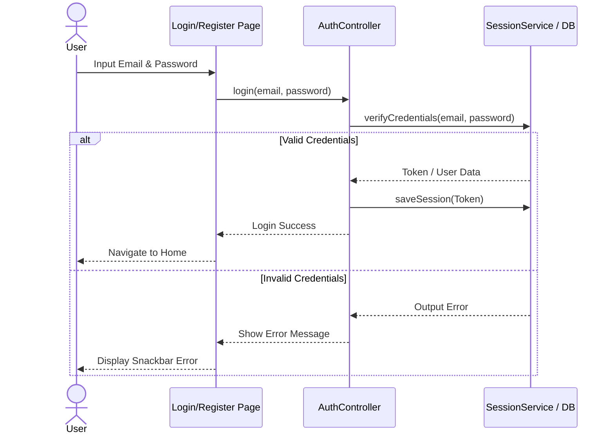
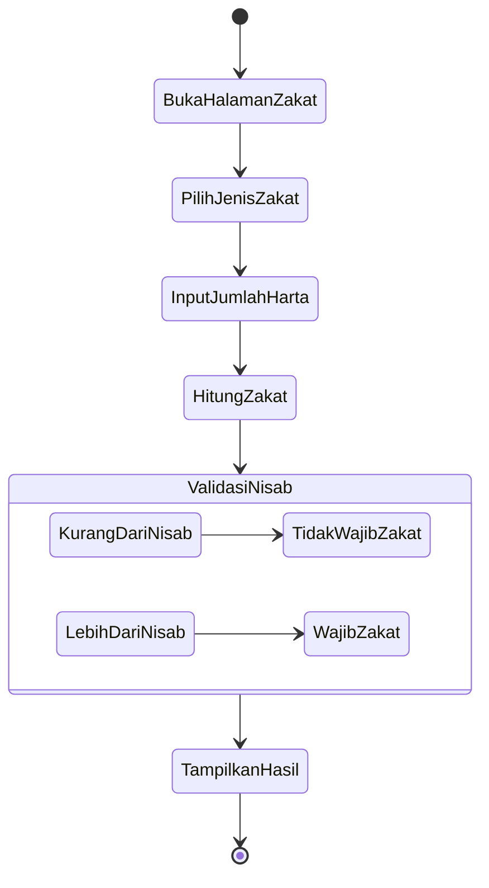

# Dokumentasi Fitur & Skenario Pengujian HidayahHub

Dokumen ini berisi penjelasan fitur utama, rancangan arsitektur UML (Use Case, Class, Sequence, dan Activity), serta skenario pengujian (testing) untuk aplikasi HidayahHub.

---

## 1. Daftar Fitur Utama
1. **Baca Al Quran**: Membaca surah dan ayat Al-Quran, melihat terjemahan, serta penanda terakhir dibaca.
2. **Kumpulan Doa**: Kumpulan doa-doa harian lengkap dengan arti dan teks Arab.
3. **Waktu & Sholat ID**: Jadwal sholat harian berdasarkan lokasi terkini pengguna.
4. **Chatbot**: Asisten AI pintar untuk menjawab pertanyaan seputar panduan agama / aplikasi.
5. **Kalkulator Zakat**: Perhitungan zakat mal dan fitrah berdasarkan masukan harta pengguna.
6. **Cari Masjid**: Pencarian masjid terdekat menggunakan GPS dan Google Maps.
7. **Arah Kiblat**: Kompas penunjuk arah kiblat terintegrasi dengan kamera (AR/Overlay).
8. **Login & Register**: Otentikasi pengguna menggunakan email/password lokal beserta biometrik.
9. **Shake Surah**: Fitur membaca surah acak dengan cara menggoyangkan (shake) perangkat.
10. **Cari Surah**: Fitur pencarian surah berdasarkan nama, ayat, atau arti.
11. **Minigames**: Permainan interaktif edukatif Islami.
12. **Notifikasi**: Pemberitahuan waktu sholat dan pengingat harian.

---

## 2. UML Diagrams (Mermaid)
*Diagram di bawah ini menggunakan sintaks [Mermaid](https://mermaid.js.org/). Anda dapat menyalin blok kode di bawah ini ke editor Mermaid atau menerapkannya langsung di file Markdown yang mendukung Mermaid.*

### A. Use Case Diagram
```mermaid
usecaseDiagram
    actor Pengguna as "Pengguna Aplikasi"
    
    package HidayahHub {
        usecase UC1 as "Login & Register"
        usecase UC2 as "Baca Al Quran"
        usecase UC3 as "Kumpulan Doa"
        usecase UC4 as "Cek Waktu Sholat"
        usecase UC5 as "Gunakan Chatbot"
        usecase UC6 as "Kalkulator Zakat"
        usecase UC7 as "Cari Masjid Terdekat"
        usecase UC8 as "Tentukan Arah Kiblat"
        usecase UC9 as "Shake Surah"
        usecase UC10 as "Cari Surah"
        usecase UC11 as "Main Minigames"
        usecase UC12 as "Terima Notifikasi"
    }

    Pengguna --> UC1
    Pengguna --> UC2
    Pengguna --> UC3
    Pengguna --> UC4
    Pengguna --> UC5
    Pengguna --> UC6
    Pengguna --> UC7
    Pengguna --> UC8
    Pengguna --> UC9
    Pengguna --> UC10
    Pengguna --> UC11
    Pengguna --> UC12
    
    UC2 ..> UC10 : <<extend>>
```

### B. Class Diagram (General Architecture)


### C. Sequence Diagram (Login & Register)


### D. Activity Diagram (Kalkulator Zakat)


---

## 3. Skenario Pengujian (Testing) Per Fitur

### 1. Baca Al Quran
- **Test Case 1 (Positif):** Membuka daftar surah, dan memastikan API mengembalikan 114 surah.
- **Test Case 2 (Positif):** Mengklik salah satu surah (misal: Al-Fatihah) dan memverifikasi ayat serta terjemahan tampil sempurna.
- **Test Case 3 (Negatif):** Membuka halaman saat koneksi internet mati (harus memunculkan pesan error koneksi atau mengambil data dari cache offline).
- **Test Case 4:** Mengujicoba menyimpan "Last Read" (Ayat terakhir dibaca) dan memverifikasi saat aplikasi dibuka kembali, posisi tersebut masih tersimpan.

### 2. Kumpulan Doa
- **Test Case 1 (Positif):** Membuka halaman doa dan memastikan daftar kategori doa tampil.
- **Test Case 2 (Positif):** Menekan doa tertentu dan memverifikasi teks Arab, Latin, dan arti muncul.
- **Test Case 3:** Mencari doa menggunakan fitur *search* bar memastikan hasil yang relevan.

### 3. Waktu & Sholat ID
- **Test Case 1 (Positif):** Menyetujui izin lokasi dan memverifikasi jadwal sholat 5 waktu yang ditampilkan sesuai dengan lokasi pengguna saat ini.
- **Test Case 2 (Negatif):** Menolak izin lokasi dan memverifikasi aplikasi memberikan fallback berupa peringatan atau fallback ke kota default (misal: Jakarta).

### 4. Chatbot
- **Test Case 1 (Positif):** Mengirimkan prompt seputar agama Islam dan memastikan balasan dari server (API) responsif dan akurat.
- **Test Case 2 (Negatif):** Mengirim pesan kosong; tombol send harus dinonaktifkan atau memberikan alert "Pesan tidak boleh kosong".
- **Test Case 3:** Memastikan *loading indicator* berjalan saat menunggu balasan dari bot.

### 5. Kalkulator Zakat
- **Test Case 1 (Positif):** Menghitung Zakat Penghasilan di atas nisab (misal input Rp 10.000.000), memastikan hasil potongan zakat bernilai 2.5% (Rp 250.000).
- **Test Case 2 (Negatif):** Menghitung Zakat di bawah nisab, memastikan peringatan "Anda belum wajib zakat" muncul.
- **Test Case 3 (Negatif):** Memasukkan input huruf alfabet pada *text field* kalkulator (harus ditolak/diblokir oleh keyboard tipe numerik).

### 6. Cari Masjid
- **Test Case 1 (Positif):** Memastikan integrasi Google Maps terbuka dengan *marker* lokasi pengguna saat berada di layar ini.
- **Test Case 2 (Positif):** Menekan tombol cari, memverifikasi pin lokasi masjid-masjid terdekat muncul di peta.
- **Test Case 3:** Mengklik salah satu pin masjid dan membuka rute tujuan via aplikasi Maps bawaan ponsel.

### 7. Arah Kiblat
- **Test Case 1 (Positif):** Mengizinkan sensor kompas dan kamera, memastikan jarum kiblat berputar mengikuti rotasi ponsel secara *realtime* di atas *camera preview*.
- **Test Case 2 (Positif):** Memverifikasi notifikasi getar (haptic feedback) saat kompas ponsel tepat mengarah lurus ke Ka'bah.
- **Test Case 3 (Negatif):** Mengetes di perangkat tanpa sensor kompas/magnetometer (harus ada notifikasi/tampilan error bahwa device tidak didukung).

### 8. Login & Register
- **Test Case 1 (Positif):** Melakukan register dengan email format benar dan *password* unik, harus berhasil masuk.
- **Test Case 2 (Negatif):** Menggunakan email yang sudah terdaftar, harus menunjukkan pesan "Email sudah dipakai".
- **Test Case 3 (Negatif):** Login menggunakan password yang salah, harus menunjukkan pesan kredensial tidak valid.
- **Test Case 4:** Menguji biometric login (sidik jari/FaceID), pastikan berhasil melewati halaman login tanpa password.

### 9. Shake Surah
- **Test Case 1 (Positif):** Menggoyangkan sensor *accelerometer* ponsel (shake device), memverifikasi bahwa halaman otomatis berpindah/memunculkan pop-up yang berisi satu surah/ayat acak.
- **Test Case 2 (Negatif):** Ponsel dalam keadaan diam tidak memicu perpindahan layar acak.

### 10. Cari Surah
- **Test Case 1 (Positif):** Mengetikkan nama surah yang valid (misal: "Yasin") pada kotak pencarian, list menampilkan surah Yasin secara instan.
- **Test Case 2 (Negatif):** Mengetikkan nama surah yang tidak ada (misal: "Xyz"), list menjadi kosong dan menampilkan pesan "Surah tidak ditemukan".

### 11. Minigames
- **Test Case 1 (Positif):** Membuka permainan edukasi Islami (seperti kuis Islami), dan memverifikasi soal bisa dijawab dan skor bertambah jika benar.
- **Test Case 2 (Positif):** Jika salah menjawab, skor tidak bertambah dan menampilkan notifikasi kesalahan.
- **Test Case 3:** Reset skor jika permainan di-restart atau permainan telah selesai.

### 12. Notifikasi
- **Test Case 1 (Positif):** Memverifikasi *push notification* / alarm lokal berbunyi tepat 1 menit sebelum dan saat masuk waktu azan sholat.
- **Test Case 2 (Positif):** Menonaktifkan toogle notifikasi/pengingat untuk salah satu waktu (misal Isya), memverifikasi notifikasi Isya tidak akan dipanggil.
- **Test Case 3:** Mengetuk notifikasi langsung membuka layar alarm/pengingat atau layar beranda di aplikasi.
